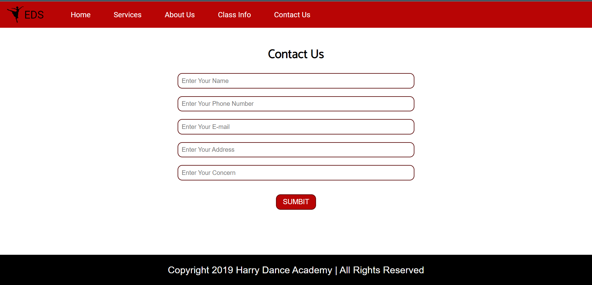

# Electra Dance Studio

Dance Electra Dance Studio is a web application built with Node.js, Express, and Pug template to manage a dance studio's contact information and store it in a MongoDB database.

## Features

- User-friendly contact us form to collect inquiries from potential clients.
- Data storage using MongoDB to save contact information.

## Technologies Used

- Node.js
- Express
- Pug
- MongoDB

## Screenshots

